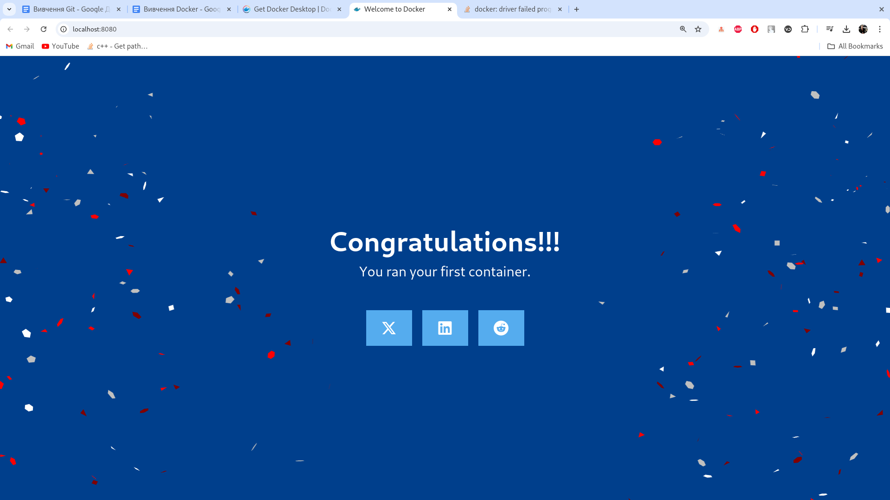

### task 1
Використовували команду docker `run -d -p 8080:80 docker/welcome-to-docker` щоб перевірити працесдатність докеру.

Перейшли до слідкуванням роботи контейнеру

### task 2
Після клону репозітория getting-started-todo-app запускаємо докер композ, який хранить у собі декілька сервесів

Змінемо файл `backend/src/routes/getGreeting.js` щоб рандомно виводити 1 з 3х фраз які запмиані у масиві.

Також файл `client/src/components/AddNewItemForm.jsx` щоб рандомно виводити 1 з 3х фраз які запмиані у масиві.

Та файл `client/src/index.scss`

Після перезаватаження сторінки усі зміни спрацювали

### task 3
Ствоюємо на докерхабі свой власний репозіторій

Собираємо вже існуючий проект в докері, використовуя команду `docker build -t bukhtahub/getting-started-todo-app .` та перевіряємо чи створився образ у докері

Закидуємо образ до докерхабу та перевіряємо

### task 4
Запускаємо докер контейнер через десктопний додаток під назвою **welcome-to-docker** та з портом 8080

Щоб зупинити контейнер та закрити порт, натискаємо кнопку stop

### task 5
Робимо пошук образу **welcome-to-docker** та бачимо подробний вивод результату пошуку

Пуллемо докер образ та получаємо подробну інфомрацію о статусі.

за допомогою команди docker image ls ми можемо передивитись усі встановлені образи

Також подивимося історію образа, що ми щойно встановили. На виході бачимо всі шари, їхні розміри та команду, яку було використано для створення шару.

### task 6
Створюємо репозіторій на докерхабі

Сконили проект з гіта та створюємо образ

після перевяряємо образ, запускаємо його на порту 8080 та робимо таг. Після цього намагаємося його закинути на репу.

Після релогіну, пуш пройшов успішно

### task 7
Білдемо та запускаємо докер композ. Бачимо що він успішно запустився. Далі закриваємо сессію

### task 8
Запускаємо базовий контейнер и віртуальний терминал від убунту. Оновлюємо пакети.

Встановлюємо ноджс та перевіряємо.

Далі у новому терміналі комітім текущі зміни у новому слою **node-base**. Перевіряємо історію та праціздатність. 

Після видаляємо базовий образ

### task 9
Скачали app.zip з документації докера та разпаковуємо. Створюємо **Dockerfile**, стврорюємо директорію з проектом

Белдемо проект. Пройшло успішно.Так як ми не дали назву образу, перевіремо увесь список та запустимо його по ID

Створюємо таг для вже зібраного імеджу за допомогою ``docker image tag``

### task 10
Зайдемо у попередньо склоновону та спробуємо ще раз збілдити. Як ми бачимо, докер узяв уже опрацьовані степи к кеша.

Змінемо порядок степов у докерфайлі. Створемо **.dockerignore** файл та перебілдемо проект. Деякі степи досі 
беруться з кешу.

### task 11
Генеруємо Spring проект https://start.spring.io/ та создамо докерфайл

Білдемо успішно

Запускаємо контейнер за допомогою ``docker run -d -p 8080:8080 spring-helloworld`` та перевіряємо результат через 
локалхост 8080
Тепер попробуємо мульті-шагову зборку

Перший етап залишається таким самим, як і попередній Docker-файл, надаючи середовище Java Development Kit (JDK) для побудови програми. Цей етап називається builder. 
Другий етап - це новий етап, який називається final. На ньому використовується стрункіший образ **eclipse-temurin:21.0.2_13-jre-jammy**, який містить лише середовище виконання Java (JRE), необхідне для запуску програми. Цей образ містить середовище виконання Java (JRE), якого достатньо для запуску скомпільованої програми (JAR-файл).
Під час збірки, можемо побачити збірку кожного стейджа. Під кінець у нас є два образа, один з яких тримає у собі мінімум для працездатності контейнера.

### task 12:
Створемо докер композ щоб автоматично запускати сервиси на специфічному порті

